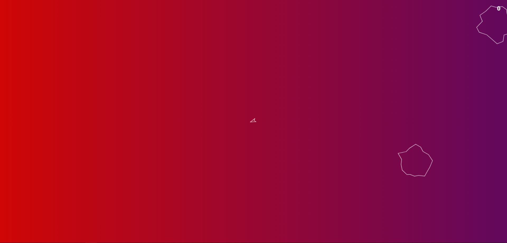

# Space-Rocker
A variant of the original game Space Rocks by createjs with improved visuals and user experience.

CreateJs is a suite of modular libraries and tools which work together or independently to enable rich interactive content on open web technologies via HTML5. 
# 1. TweenJS 
TweenJS is a simple tweening library for use in Javascript. It was developed to integrate well with the EaselJS library, but is not dependent on or specific to it (though it uses the same Ticker and Event classes by default). It supports tweening of both numeric object properties & CSS style properties.
# 2. PreloadJS
PreloadJS is a library to make working with asset preloading easier. It provides a consistent API for loading different file types, automatic detection of XHR (XMLHttpRequest) availability with a fallback to tag-base loading, composite progress events, and a plugin model to assist with preloading in other libraries such as SoundJS.
# 3. EaselJS
EaselJS is a library for building high-performance interactive 2D content in HTML5. It provides a feature-rich display list to allow you to manipulate and animate graphics. It also provides a robust interactive model for mouse and touch interactions.
It is excellent for building games, generative art, ads, data visualization, and other highly graphical experiences. It works well alone, or with the rest of the CreateJS suite: SoundJS, PreloadJS, and TweenJS.
It has no external dependencies, and should be compatible with virtually any framework you enjoy using.
